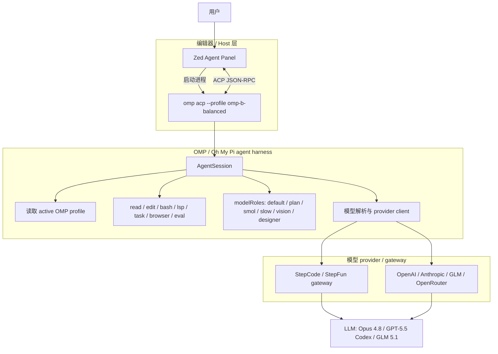
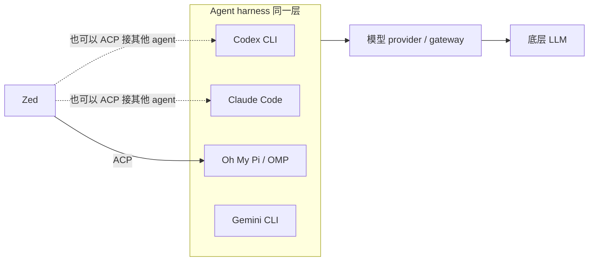
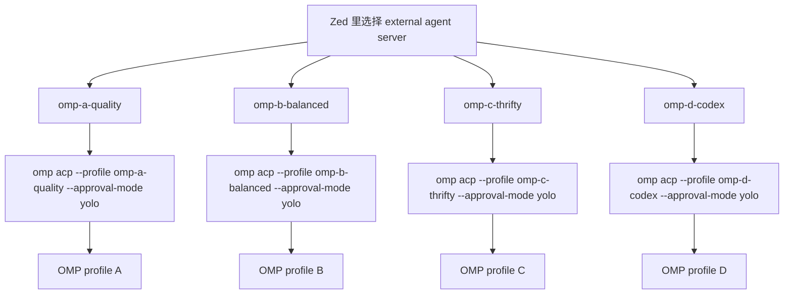
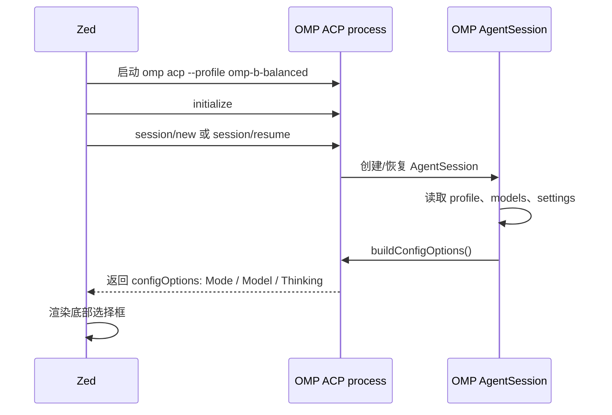
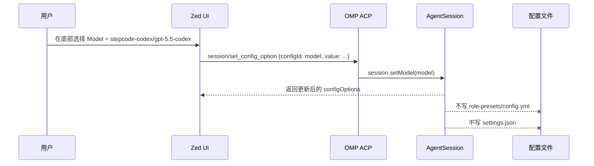
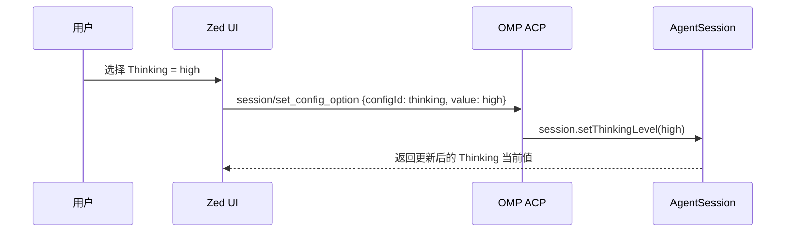
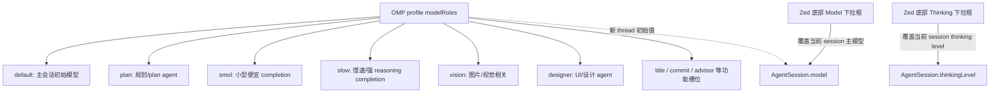
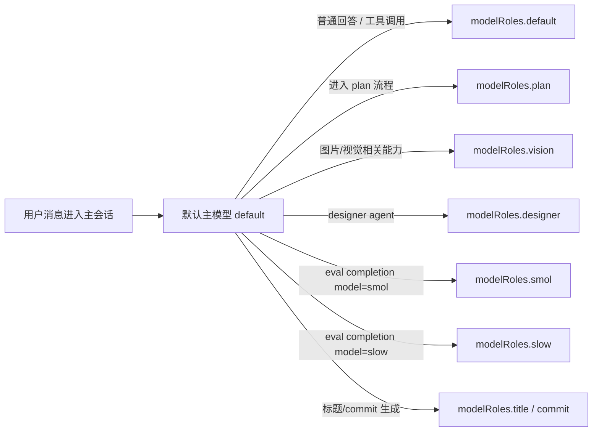
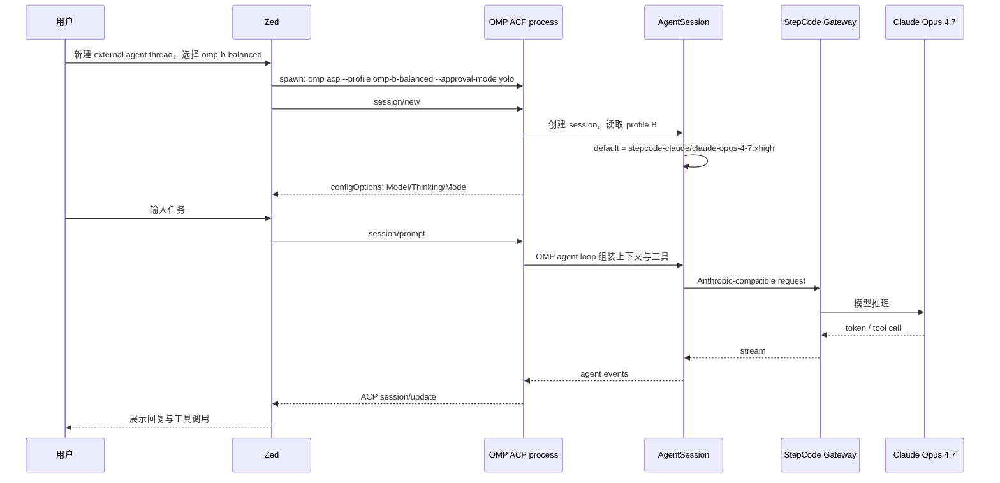
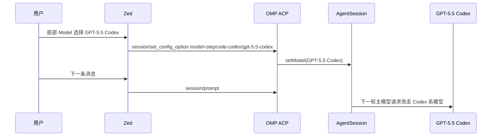

# Zed、OMP、Agent Harness 与 LLM 的关系

> Topic: Zed External Agents / Oh My Pi / ACP / model routing
> Category: `coding-agents`
> Last checked: 2026-06-16

## 1. 一句话总结

Zed、OMP、Codex/Claude Code 这类 agent harness、以及底层 LLM 不是同一层东西：Zed 负责 UI 与 ACP 连接，OMP 负责 agent runtime、工具、会话和模型路由，StepCode / OpenAI / Anthropic / GLM 等 provider 负责模型推理。Zed 底部的 model / effort 下拉框不是 Zed 自己读取 OMP YAML 后生成的，而是 OMP 通过 ACP 在当前 session 里暴露给 Zed 的可配置项；选择后通常只影响当前 thread，不会改 OMP profile 文件。

## 2. 先把四个概念拆开

| 层级 | 代表 | 负责什么 | 不负责什么 |
|---|---|---|---|
| 编辑器 / Host | Zed | UI、thread 面板、启动 external agent、通过 ACP 收发消息、渲染模型/effort 选择框 | 不直接执行 OMP 的 agent loop，不直接解析 OMP 的 `modelRoles` 策略 |
| Agent harness / Runtime | OMP、Codex CLI、Claude Code、Gemini CLI | 维护会话、组装上下文、决定工具调用、执行 workflow / skill / memory / plan / subagent、选择模型 | 本身不是 LLM，不等于某一个模型 |
| 模型 Provider / Gateway | StepCode、OpenAI、Anthropic、GLM、OpenRouter、内部代理 | 接收 HTTP 请求，运行模型推理，返回 token stream | 不知道 Zed thread UI，也不管理 agent 工具和会话 |
| LLM / 模型 | `gpt-5.5-codex`、`claude-opus-4-8`、`glm-5.1` | 生成文本、工具调用参数、推理输出 | 不自己读文件、不自己跑 shell、不自己管理权限 |

一句话：**Zed 管界面，OMP 管 agent 行为，LLM provider 管推理。**

## 3. 最重要的架构图



这张图里，Zed 和 LLM 中间隔着 OMP。Zed 并不会直接调用 `claude-opus-4-8`，也不会自己决定 OMP 该用 `smol` 还是 `slow`；它把用户输入发给 OMP，OMP 再按自己的 runtime 逻辑调用 provider。

## 4. OMP 不是“包了一层 Codex CLI”

容易误解的一点是：看到 `stepcode-codex/gpt-5.5-codex`，就以为链路是：

```text
Zed → OMP → Codex CLI → GPT-5.5 Codex
```

这不准确。更准确是：

```text
Zed → OMP → StepCode Codex 模型接口 → GPT-5.5 Codex
```

Codex CLI、Claude Code、OMP 都是 agent harness。它们同属一层：都可以读文件、跑命令、调工具、维护上下文、做代码修改。`gpt-5.5-codex` 是 OMP 可以选择的一个底层模型，不代表 OMP 会启动 Codex CLI。



所以 `omp-d-codex` 这个名字的含义是：**OMP 这个 agent harness 的 default 模型设成了 Codex 系模型**，不是“OMP 里面再调起 Codex agent”。

## 5. Zed 如何启动不同 OMP 配置

当前整理后的思路是：每个 Zed custom agent server 对应一个 OMP profile。



示例映射：

| Zed server 名称 | OMP profile | `modelRoles.default` |
|---|---|---|
| `omp-a-quality` | A · quality | `stepcode-claude/claude-opus-4-8:xhigh` |
| `omp-b-balanced` | B · balanced | `stepcode-claude/claude-opus-4-7:xhigh` |
| `omp-c-thrifty` | C · thrifty | `stepcode-oai/glm-5.1` |
| `omp-d-codex` | D · codex | `stepcode-codex/gpt-5.5-codex:xhigh` |

Zed 只负责执行 command / args。真正的模型、工具、role、provider、auth 都由 OMP profile 和 OMP runtime 决定。

## 6. Zed 的 model / effort 下拉框从哪里来

Zed 不是自己扫描：

```text
~/.omp/agent/models.yml
~/.omp/agent/config.yml
~/.omp/profiles/*/agent/config.yml
```

实际流程是：



OMP 暴露给 Zed 的 config options 通常包括：

| Zed UI 项 | ACP config id | OMP 侧含义 |
|---|---|---|
| Mode | `mode` | Default / Plan 等 ACP session mode |
| Model | `model` | 当前 session 主模型 |
| Thinking / Effort | `thinking` | 当前 session thinking level：off / auto / low / medium / high / xhigh 等 |

所以模型列表来自 OMP 当前运行时的 `getAvailableModels()` 结果。Zed 只是渲染 OMP 给出的选项。

## 7. 在 Zed 里改模型，会不会改 OMP 配置文件

不会改 profile 文件。它走的是 ACP 的当前 session 配置更新。



同理，选择 effort / thinking 时：



影响范围：

| 操作 | 影响当前 thread | 影响恢复同一 thread | 影响新 thread | 改写 OMP profile 文件 |
|---|---:|---:|---:|---:|
| Zed 底部切 Model | 是 | 通常会随 session 状态恢复 | 否 | 否 |
| Zed 底部切 Thinking / Effort | 是 | 通常会随 session 状态恢复 | 否 | 否 |
| 修改 OMP profile 的 `modelRoles.default` | 之后新 session 生效 | 取决于旧 session 是否已有覆盖 | 是 | 是 |
| 修改 Zed `agent_servers` command/args | 新启动的 ACP process 生效 | 旧进程不变 | 是 | 是 |

## 8. `modelRoles` 和 Zed 下拉框的区别

`modelRoles` 是 OMP 的策略配置；Zed 下拉框是当前 session 的覆盖项。



关键区别：

| 维度 | `modelRoles` | Zed 底部 model / effort |
|---|---|---|
| 所在位置 | OMP profile / config | Zed UI 触发的 ACP session state |
| 用途 | 定义整套模型策略 | 临时调整当前 thread 主模型或 thinking |
| 是否影响 `plan/smol/slow/vision/designer` | 是 | 通常否，只改当前主 session 模型/effort |
| 是否适合作为长期默认 | 是 | 否 |
| 是否会写入 OMP YAML | 是，手动改 profile 时 | 否 |

## 9. 角色路由不是“每条消息自动判断难度”

`modelRoles` 容易被误解成一个全自动难度路由器：

```text
用户问题简单 → smol
用户问题困难 → slow
用户问题要设计 → designer
```

这不是 OMP 的默认工作方式。更准确是：**功能型路由**。



普通聊天不会因为“看起来难”就必然从 `default` 自动切到 `slow`。但当 OMP 的某个子系统、工具、slash command、agent 类型或 workflow 明确需要某个 role 时，它会从 `modelRoles` 里取对应模型。

## 10. `smol` / `slow` 到底是什么

`smol` 和 `slow` 更像 OMP 内部工具与扩展可用的通用档位。

典型入口是 OMP 的 `eval` 工具环境里的 `completion()` helper：

```python
completion("把这段日志压缩成 5 条关键信息", model="smol")
completion("审查这个并发设计有没有死锁风险", model="slow")
```

对应关系：

```text
model="smol" → pi/smol → modelRoles.smol
model="slow" → pi/slow → modelRoles.slow
```

这不代表普通主会话会自动使用 `smol` 或 `slow`。它代表当 OMP 内部工具、扩展或高级 workflow 明确请求这两个档位时，有一个统一配置位置。

## 11. 四个常见使用姿势

### 11.1 想长期换策略：选不同 Zed server

```text
日常均衡 → omp-b-balanced
质量优先 → omp-a-quality
省钱优先 → omp-c-thrifty
代码 Codex 主力 → omp-d-codex
```

这是最清晰的方式。每个 server 对应一个独立 OMP profile。

### 11.2 当前 thread 临时换模型：用 Zed 底部 Model

适合：当前对话已经进行到一半，只想临时换主模型。

不适合：长期改变这个 profile 的默认策略。

### 11.3 当前 thread 临时换 effort：用 Zed 底部 Thinking / Effort

适合：同一模型临时要更高或更低 reasoning effort。

注意：不是每个 provider 都支持所有 effort；OMP 会按 model compatibility 做参数映射或裁剪。

### 11.4 想永久改默认：改 OMP profile

应该改类似：

```text
~/.omp/agent/role-presets/config-A-quality.yml
~/.omp/agent/role-presets/config-B-balanced.yml
~/.omp/agent/role-presets/config-C-thrifty.yml
~/.omp/agent/role-presets/config-D-codex.yml
```

而不是在 Zed 底部下拉框里改。

## 12. 端到端链路示例

以 `omp-b-balanced` 为例：



如果用户在中途把 Zed 底部 Model 切成 `stepcode-codex/gpt-5.5-codex`：



## 13. 常见误区

| 误区 | 更准确的说法 |
|---|---|
| “OMP 是 Codex 的 wrapper。” | OMP 和 Codex CLI 都是 agent harness；OMP 可以调用 Codex 系模型，但不是包 Codex CLI。 |
| “Zed 直接读取 OMP 配置生成模型列表。” | Zed 通过 ACP 接收 OMP 当前 session 返回的 `configOptions`。 |
| “Zed 底部选模型会改 OMP profile。” | 通常只改当前 session 的主模型状态，不改 YAML。 |
| “`modelRoles` 会按每条消息难度自动路由。” | 它主要是功能型 role 路由：plan、vision、designer、smol、slow 等由对应流程/工具触发。 |
| “选了 `omp-c-thrifty` 就不能临时用 Opus。” | 可以在当前 thread 的 Zed Model 下拉框临时切；但新 thread 仍回到 thrifty profile 的 default。 |
| “Effort 是 Zed 的 OpenAI 参数。” | 对 external agent thread 来说，Zed 只是把 thinking/effort 选择通过 ACP 发给 OMP；具体 provider 参数由 OMP 映射。 |

## 14. 实用心智模型

```text
长期策略：选哪个 Zed external agent server
当前 thread 主模型：Zed 底部 Model 下拉框
当前 thread reasoning：Zed 底部 Thinking / Effort 下拉框
内部功能模型：OMP modelRoles
实际推理：StepCode / OpenAI / Anthropic / GLM provider
```

更压缩一点：

```text
Zed server 名称 = 选择哪套 OMP profile
OMP profile = 定义长期 agent 策略
Zed model 下拉框 = 当前 thread 的临时主模型覆盖
Zed effort 下拉框 = 当前 thread 的临时 thinking 覆盖
LLM provider = 真正跑 token 的地方
```

## 15. Sources

- Zed docs: External Agents, https://zed.dev/docs/ai/external-agents
- Zed docs: Agent Settings, https://zed.dev/docs/ai/agent-settings
- Agent Client Protocol, https://agentclientprotocol.com
- oh-my-pi repository, https://github.com/can1357/oh-my-pi
- Local OMP documentation checked on 2026-06-16: `omp://models.md`, `omp://settings.md`, `omp://tools/eval.md`, `omp://config-usage.md`
